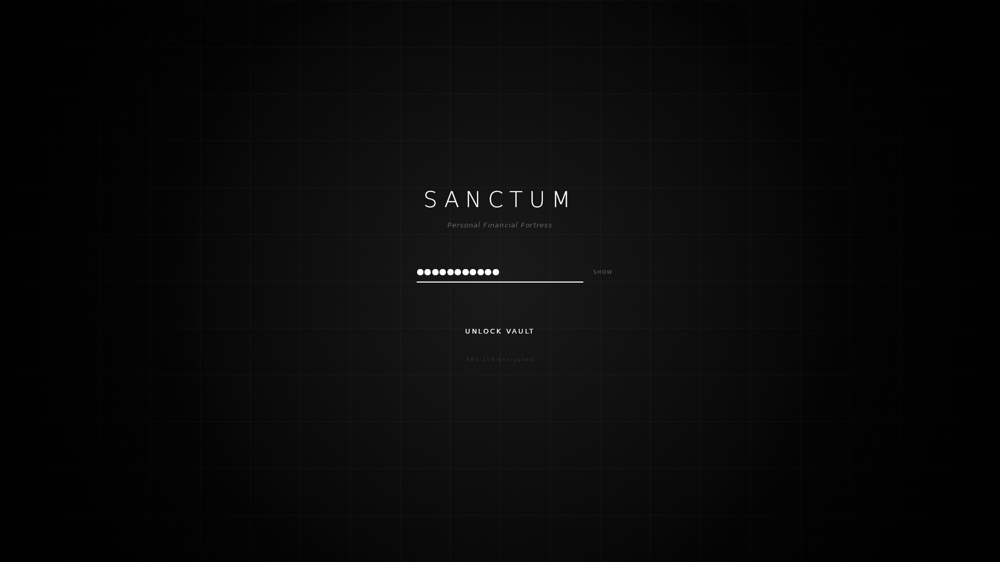

<div align="center">

<h1>SANCTUM</h1>

<p align="center">
  
</p>

[Versión en Español](README_ES.md)

<div align="center">
    <a href="">
      
    </a>
    <a href="">
      
    </a>
    <a href="">
      
    </a>
    <a href="">
      
    </a>
    <a href="">
      
    </a>
  </div>

<br />
</div>

---



## About

> **NOT READY FOR USE, IN DEVELOPMENT**

**Sanctum** is a desktop application designed for those who refuse to compromise
on privacy. Unlike cloud-based solutions or heavy web-wrappers, Sanctum runs entirely
offline on your Linux machine with native performance.

Your financial data, crypto portfolio, and habits are stored in a local **SQLite
database encrypted with SQLCipher**. You hold the keys. No servers, no tracking,
no leaks.

## Key Features

- **Military-Grade Encryption:** Zero-knowledge architecture. The database is
  unreadable without your master password (AES-256 + 600k iterations).
- **Financial Ledger:** Advanced management of wallets, income, expenses, and
  transfers. Complete audit trail.
- **Crypto Portfolio:** Investment tracking, PnL (Profit/Loss) calculation, and
  multi-wallet asset aggregation.
- **Habit Tracking:** Streak monitoring and daily consistency checks integrated into your workflow.
- **Analytics:** Net worth trajectory charts and expense breakdown.
- **Native Performance:** Built with Slint and Skia for a GPU-accelerated,
  lightweight interface (No WebKit/Chromium RAM usage).
- **Linux Native:** Optimized for the Linux desktop ecosystem (Wayland & X11 support).

## Tech Stack

Sanctum is built prioritizing performance, type safety, and auditability.

| Component            | Technology             | Description                                                       |
| :------------------- | :--------------------- | :---------------------------------------------------------------- |
| **Core** | **Rust** | Business logic, financial calculations, and security.             |
| **GUI Framework** | **Slint** | Native Rust-based UI toolkit. Lightweight and type-safe.          |
| **Renderer** | **Skia / OpenGL** | High-performance 2D graphics rendering via Winit.                 |
| **Database** | **SQLite + SQLCipher** | Locally encrypted relational storage.                             |
| **Environment** | **Nix + Direnv** | Reproducible and hermetic development environment.                |

## Installation & Development

This project uses **Nix Flakes** to guarantee a reproducible environment without
polluting your global system. You don't need to manually install Rust or
system libraries.

### Prerequisites

- [Nix Package Manager](https://nixos.org/download.html)
- [Direnv](https://direnv.net/) (Optional, but highly recommended)
- Git

### Quick Start

1. **Clone the repository:**
   ```bash
   git clone https://codeberg.org/Kyronix/Sanctum.git
   cd Sanctum
   ````

2.  **Activate the Environment:**

      - **Option A (Recommended with `direnv`):** If you have `direnv` installed,
        simply allow the environment. This will automatically load Rust, Slint dependencies,
        and system libraries (Wayland/GL) upon entering the folder.

        ```bash
        direnv allow
        ```

      - **Option B (Manual with Nix):**

        ```bash
        nix develop
        ```

3.  **Run in Development Mode:** Once inside the Nix shell, launch the app:

    ```bash
    cargo run
    ```

For detailed setup on other platforms (manual Linux, macOS, Windows), see [docs/BUILDING.md](docs/BUILDING.md).

## Development Transparency

This is a modern Open Source project that embraces the evolution of software
development.

  - **Architecture and Vision:** Designed and directed by humans, prioritizing
    privacy and local security.
  - **AI Collaboration:** Parts of the code have been generated and refactored
    with the assistance of advanced LLMs. Models such as **Gemini 3 Pro**,
    **Claude Opus 4.5**, **Claude Sonnet 4.5**, and **Codex 5.2** have been used
    under strict human supervision and auditing to ensure security and business
    logic.
  - **Auditability:** The code is open so anyone can verify that there is no
    hidden telemetry or attack vectors.

## Disclaimer

**Sanctum is currently in ALPHA.** Although the encryption used is
industry-standard, the software is under active development. Always keep backups
of your recovery keys.

## License

This project is open-source and available under the **GNU General Public License
v3.0**. See the [LICENSE](LICENSE) file for more info.

-----

<div align="center">
<sub>Built with ❤️, 🦀 Rust and ❄️ Nix</sub>
</div>
