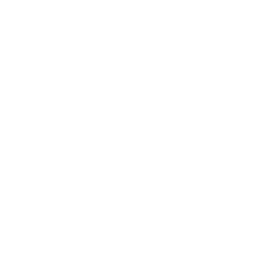
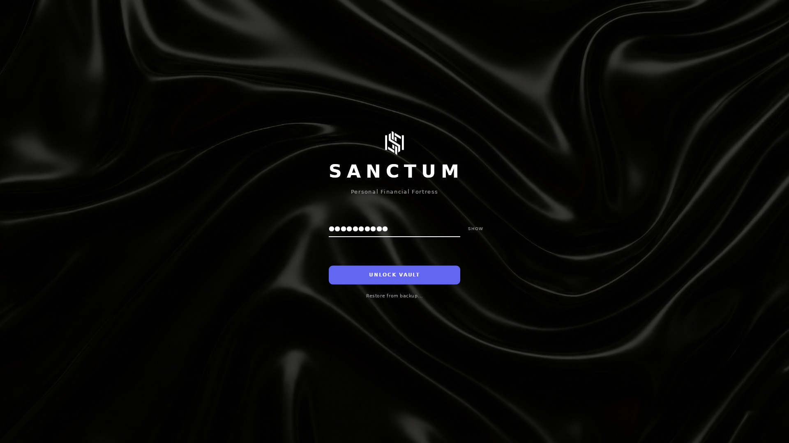

<div align="center">



<h1>SANCTUM</h1>

<p align="center">
  
</p>

<div align="center">

[](README_ES.md) [](https://kyronix.codeberg.page/Sanctum/)

</div>

<div align="center">
    <a href="">
      
    </a>
    <a href="">
      
    </a>
    <a href="">
      
    </a>
    <a href="">
      
    </a>
    <a href="">
      
    </a>
  </div>

<br />
</div>

---



## About

> **NOT READY FOR USE, IN DEVELOPMENT**

**Sanctum** is a privacy-first desktop vault for money, crypto, and habits. It runs
locally on Linux with encrypted storage, no telemetry, and zero cloud dependency.
You keep the keys, the database, and the backups.

## Current Capabilities

- **Core Analytics:** Net worth and trend analytics across finance + crypto via a unified Dashboard.
- **Finances:** Accounts, categories, transfers, and full transaction ledger.
- **Advanced Crypto:**
  - Wallets, trades, and swaps with automated portfolio balancing.
  - Privacy-preserving price sync via CoinGecko and proxy support.
  - **Tax Engine:** Offline-first reporting for Chile (SII/IPC), USA (IRS), and International jurisdictions (FIFO, LIFO, HIFO, CPP). See [CRYPTO_TAX.md](docs/CRYPTO_TAX.md) for technical details.
- **Habits:** Daily logs, heatmaps, streaks, and rewards/goals.
- **Reliability & Privacy:**
  - JSON/CSV/TXT ingestion with manual IPC data import and duplicate detection.
  - Locally encrypted backups (SQLCipher) with restore and rollback safety.
  - Multi-language support (EN/ES) and multi-currency support (USD, CLP, EUR, etc.).

## Import Formats

Sanctum accepts multiple offline formats, designed for travel or low-connectivity workflows:

- **JSON** (recommended): Full-fidelity format used by the Sanctum Generator.
- **CSV**: Spreadsheet exports (separate files for transactions, habit logs, crypto).
- **TXT**: Prefixed, line-based notes for quick capture.

All imports are **best-effort**, validated per row, and include duplicate detection.
No network calls are made during ingestion.

## Security & Privacy

Sanctum is built on three core pillars:
1. **Zero Cloud:** No telemetry, no cloud sync, no accounts. Your data never leaves your machine.
2. **Hardened Storage:** SQLCipher encryption with industry-standard AES-256 for the entire database.
3. **Mitigated External Connections:** Price sync uses traffic padding (obfuscating your portfolio) and supports user-configured proxies (SOCKS5/Tor, HTTP) to reduce data exposure. While we minimize metadata, connecting to external APIs inherently reveals your IP address to the provider unless routed through a proxy.

- **SQLCipher encryption** with a user-held master password.
- **Encrypted backups** with restore + rollback safety.

## Tech Stack

Sanctum prioritizes performance, type safety, and auditability.

| Component            | Technology             | Description                                                       |
| :------------------- | :--------------------- | :---------------------------------------------------------------- |
| **Core**             | **Rust**               | Business logic, validation, and calculations.                     |
| **GUI Framework**    | **Slint**              | Native Rust UI toolkit. Lightweight and type-safe.                |
| **Renderer**         | **Skia / OpenGL**       | High-performance 2D rendering via Winit.                          |
| **Database**         | **SQLite + SQLCipher**  | Locally encrypted relational storage.                             |
| **Environment**      | **Nix + Direnv**        | Reproducible dev environment.                                     |

### Installation & Development

This project uses **Nix Flakes** to guarantee a reproducible environment without
polluting your global system.

> **Note:** For manual installation on Linux, macOS, or Windows, please see the complete [Building Guide](docs/BUILDING.md).

### Quick Start (Nix)

1. **Clone the repository:**
   ```bash
   git clone https://codeberg.org/Kyronix/Sanctum.git
   cd Sanctum
   ```

2. **Activate the Environment:**
   ```bash
   direnv allow
   ```

3. **Verify the workspace:**
   ```bash
   # Or without --release
   nix develop -c cargo run --release
   ```

For detailed setup on other platforms, see [docs/BUILDING.md](docs/BUILDING.md).

## Development Transparency

This project embraces open collaboration without compromising auditability.

- **Human-led architecture:** Privacy and data integrity are the priority.
- **AI-assisted development:** Most of the code has been generated or
  refactored with LLMs under strict human auditing. The primary models used,
  in order, are **Claude Opus 4.5 (now 4.6)**, **Claude Sonnet 4.5**, **Codex 5.2 (now 5.3)**, and
  **Gemini 3 Pro**.
- **Auditability:** The code is open for inspection and verification.

## Community & Contributing

- **Reporting Issues:** Use the [Issue Tracker](https://codeberg.org/Kyronix/Sanctum/issues) for bugs and feature requests.

## Disclaimer

**Sanctum is currently in ALPHA.** Although the encryption used is
industry-standard, the software is under active development. Always keep backups
of your recovery keys.

## License

This project is open-source and available under the **GNU General Public License
v3.0**. See the [LICENSE](LICENSE) file for more info.

-----

<div align="center">
<sub>Built with ❤️, 🦀 Rust and ❄️ Nix</sub>
</div>
