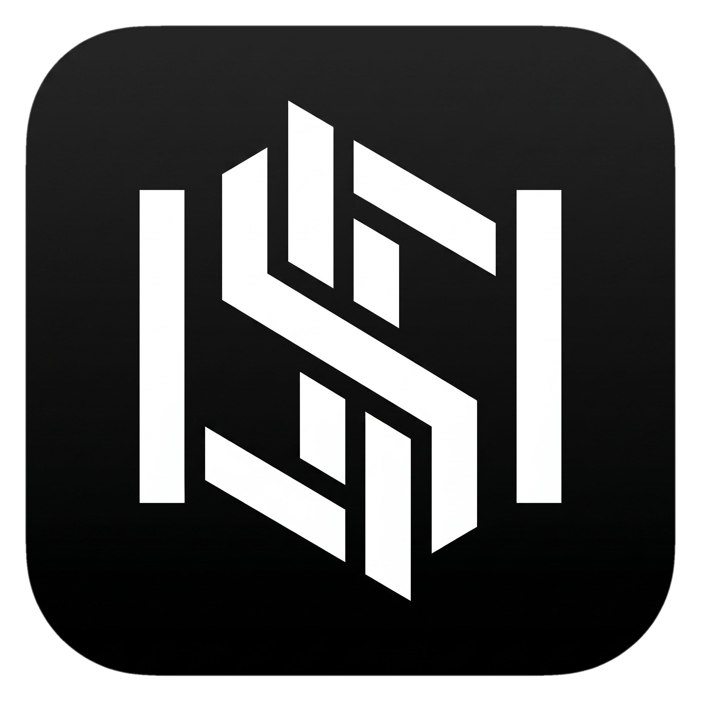
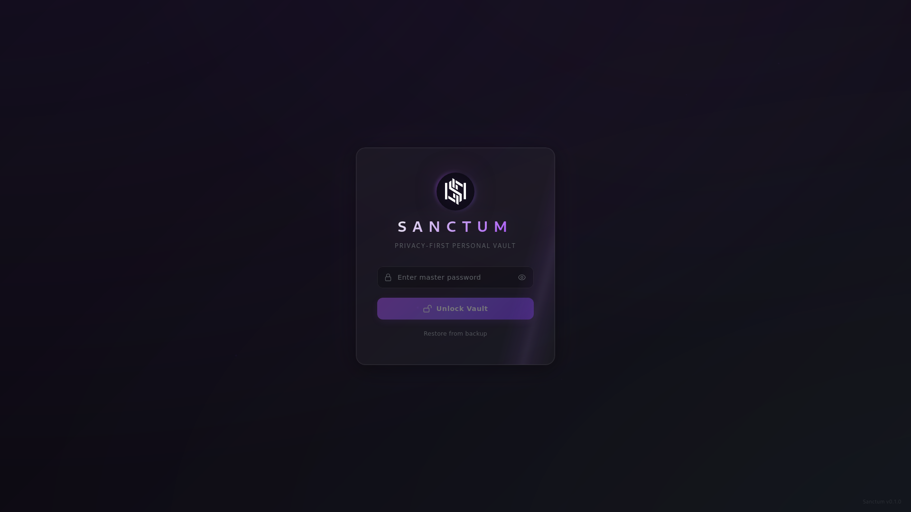

<div align="center">



<h1>SANCTUM</h1>

<p align="center">
  
</p>

<div align="center">

[](README_ES.md) [](https://kyronix.codeberg.page/Sanctum/)

</div>

<div align="center">
    <a href="">
      
    </a>
    <a href="">
      
    </a>
    <a href="">
      
    </a>
    <a href="">
      
    </a>
    <a href="">
      
    </a>
  </div>

<br />
</div>

---



<div align="center">

[](LICENSE) &nbsp;
 &nbsp;
 &nbsp;


**[About](#about)** · **[Features](#features)** · **[Import](#import--exchange-support)** · **[Security](#security--privacy)** · **[Install](#installation)** · **[Docs](docs/INSTALL.md)**

</div>

## About

> [!CAUTION]
> **NOT READY FOR USE — UNDER ACTIVE DEVELOPMENT.**

**Sanctum** is a privacy-first desktop vault for your money, crypto, and habits.
Everything runs locally: encrypted storage, no telemetry, no accounts, no cloud.
You hold the keys, the database, and the backups — nobody else.

It is built for people who want a single, auditable place to track their finances
without handing their financial life to a third party.

## Features

### Unified Dashboard
Net worth and trend analytics across your finances **and** crypto in one view.

### Finances
Accounts, categories, transfers, and a complete transaction ledger, with
multi-currency support (USD, CLP, EUR, and more).

### Crypto
- Wallets, trades, and swaps with automated portfolio balancing.
- Privacy-preserving price sync via CoinGecko, with proxy / Tor support.
- **Offline tax engine** for Chile (SII), the USA (IRS), and international
  jurisdictions, applying the right cost-basis method per local rules
  (FIFO, CPP, and more). See **[CRYPTO_TAX.md](docs/CRYPTO_TAX.md)** for the
  logic and legal foundations behind it.

### Habits
Daily logs, heatmaps, streaks, and rewards/goals to keep momentum.

### Reliability
- Encrypted backups (SQLCipher) with restore and rollback safety.
- JSON/CSV/TXT import with per-row validation and duplicate detection.
- Multi-language interface (EN/ES).

## Import & Exchange Support

Sanctum is **offline- and CSV-first** — designed for travel and low-connectivity
workflows. All imports are best-effort, validated per row, deduplicated, and make
**no network calls** during ingestion.

> [!IMPORTANT]
> Every exchange/wallet file is processed **locally on your device**. Nothing is
> ever uploaded to a Sanctum server — there are no Sanctum servers.

**Supported formats:**

- **JSON** *(recommended)* — full-fidelity format used by the Sanctum Generator.
- **CSV** — spreadsheet exports (separate files for transactions, habits, crypto).
- **TXT** — prefixed, line-based notes for quick capture.

**Exchange & wallet integrations:**

| Integration | Status | Input | Notes |
| :-- | :-- | :-- | :-- |
| Kraken | Available | CSV (`Ledgers`, `Trades`) | Upload one or both files for full spot coverage. |
| Binance | Available | CSV (`All Statements`, `Spot Trade History`) | Balances, spot activity, and related ledger movements. |
| MEXC | Available | CSV (17 report types) | Spot, Statement, Funding, Fiat, Futures, and related exports. |
| NotBank (ex-CryptoMarket) | Available | CSV (`Transaction`, `Trade Activity`) | Account movements and trading from Exchange Pro reports. |
| Feather Wallet | Available | CSV (history export) | Monero wallet history in Feather format. |
| Monero GUI Wallet | Available | CSV (history export) | Monero wallet history in Monero GUI format. |

<details>
<summary><b>Planned integrations</b></summary>

| Integration | Status | Input | Notes |
| :-- | :-- | :-- | :-- |
| Coinbase | Planned | CSV | Account statement and trade history flows. |
| Bybit | Planned | CSV | Spot/funding history exports. |
| OKX | Planned | CSV | Account and trade export formats. |
| KuCoin | Planned | CSV | Statement/trade CSV imports. |
| Bitget | Planned | CSV | Wallet and spot export reports. |
| Buda | Planned | CSV | Transaction/trade exports. |
| Orionx | Planned | CSV | Transaction/trade exports. |
| Exchange APIs (read-only) | Planned | API | Future direct sync — read-only, no trading/withdrawals. |

</details>

## Security & Privacy

Sanctum rests on three pillars:

1. **Zero cloud.** No telemetry, no sync, no accounts. Your data never leaves your machine.
2. **Hardened storage.** SQLCipher (AES-256) encrypts the entire database with a master password you hold.
3. **Mitigated external connections.** Price sync uses traffic padding to obfuscate your portfolio and supports user-configured proxies (SOCKS5/Tor, HTTP).

> [!NOTE]
> Minimizing metadata is not the same as eliminating it: connecting to any
> external API inherently reveals your IP to that provider unless you route the
> traffic through a proxy.

Backups are encrypted at rest and ship with restore + rollback safety.

## Tech Stack

Sanctum prioritizes performance, type safety, and auditability.

| Component       | Technology           | Role                                          |
| :-------------- | :------------------- | :-------------------------------------------- |
| **Core**        | **Rust**             | Business logic, validation, calculations.     |
| **Shell**       | **Tauri 2**          | Lightweight native shell with WebView.        |
| **Frontend**    | **Svelte 5 + TS**    | Reactive UI with TypeScript and Vite.         |
| **Database**    | **SQLite + SQLCipher** | Locally encrypted relational storage.       |
| **Environment** | **Nix + Direnv**     | Reproducible, hermetic dev environment.       |

## Installation

> [!NOTE]
> Full setup for **Linux, macOS, and Windows** — including the prerequisite
> toolchain — lives in the **[Installation Guide](docs/INSTALL.md)**.

The repository ships an [`install.sh`](install.sh) that builds from source and
installs Sanctum. On Linux it installs the binary, desktop entry, and icon; on
macOS it installs the binary only.

```bash
git clone https://codeberg.org/Kyronix/Sanctum.git
cd Sanctum
./install.sh --user      # builds + installs to ~/.local, no sudo
```

### Quick Start (Nix, for development)

This project uses **Nix Flakes** for a reproducible environment, plus
**Node.js** and **pnpm** for the Svelte frontend. All commands run from the
**repository root**:

```bash
direnv allow                          # or: nix develop
cd ui-svelte && pnpm install && cd ..  # first time only
cargo tauri dev                       # run in development mode
cargo tauri build                     # build a production binary
```

See **[docs/INSTALL.md](docs/INSTALL.md)** for the manual toolchain and
platform-specific notes.

## Development Transparency

This project embraces open collaboration without compromising auditability.

- **Human-led architecture.** Privacy and data integrity are the priority, designed and directed by humans.
- **AI-assisted development.** Most of the code is generated or refactored with frontier LLMs under strict human auditing. The primary models, in order, are **Claude Opus 4.7**, **Claude Sonnet 4.6**, and **DeepSeek V4 Pro**, among other frontier models.
- **Auditable by design.** The full source is open for inspection — verify for yourself that there is no hidden telemetry.

## Contributing

Found a bug or have an idea? Use the
[Issue Tracker](https://codeberg.org/Kyronix/Sanctum/issues) for bugs and feature
requests.

## Disclaimer

**Sanctum is currently in ALPHA.** The encryption is industry-standard, but the
software is under active development and may change without notice. **Always keep
backups of your recovery keys.**

## License

Open source under the **GNU General Public License v3.0**. See the
[LICENSE](LICENSE) file for details.

-----

<div align="center">
<sub>Built with ❤️, 🦀 Rust and ❄️ Nix</sub>
</div>
