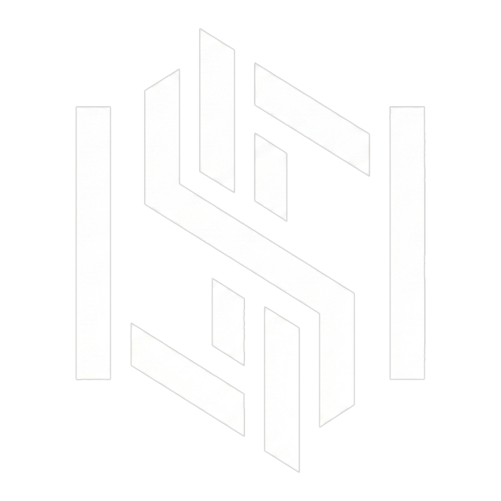

<div align="center">



<h1>SANCTUM</h1>

<p align="center">
  
</p>

<div align="center">

[](README.md) [](https://kyronix.codeberg.page/Sanctum/)

</div>

<div align="center">
    <a href="">
      
    </a>
    <a href="">
      
    </a>
    <a href="">
      
    </a>
    <a href="">
      
    </a>
    <a href="">
      
    </a>
  </div>

<br />
</div>

---


## Acerca de

> **NO ESTA LISTO PARA USAR, EN DESARROLLO**

**Sanctum** es una bóveda de escritorio orientada a privacidad para finanzas, crypto y hábitos.
Funciona localmente en Linux, con almacenamiento cifrado, cero telemetría y sin dependencia
de la nube. Tú controlas las llaves, la base de datos y los respaldos.

## Capacidades Actuales

- **Analítica Central:** Patrimonio neto y tendencias combinando finanzas + crypto en un Dashboard unificado.
- **Finanzas:** Cuentas, categorías, transferencias y ledger completo de transacciones.
- **Crypto Avanzado:**
  - Billeteras, trades y swaps con balance dinámico de portafolio.
  - Sincronización privada de precios vía CoinGecko y soporte de proxy.
  - **Motor de Impuestos:** Reportes offline para Chile (SII/IPC), USA (IRS) y jurisdicciones internacionales (FIFO, LIFO, HIFO, CPP). Ver [CRYPTO_TAX.md](docs/CRYPTO_TAX.md) para detalles técnicos.
- **Hábitos:** Registros diarios, heatmaps, rachas y recompensas/objetivos.
- **Confiabilidad y Privacidad:**
  - Ingesta JSON/CSV/TXT con importación manual de datos IPC y detección de duplicados.
  - Respaldos cifrados localmente (SQLCipher) con seguridad de restauración y rollback.
  - Soporte multi-idioma (EN/ES) y múltiples divisas (USD, CLP, EUR, etc.).

## Formatos de Importación

Sanctum acepta formatos offline pensados para viajes o baja conectividad:

- **JSON** (recomendado): Formato completo usado por el Sanctum Generator.
- **CSV**: Exportes desde hojas de cálculo (archivos separados por tipo).
- **TXT**: Notas por línea con prefijos para captura rápida.

Todos los imports son **best-effort**, se validan por fila y hacen deduplicación.
No se realizan llamadas de red durante la ingesta.

## Integraciones de Exchange/Wallet

Todos los CSV de exchange/wallet se procesan localmente en tu dispositivo y no se suben a servidores de Sanctum.

| Integración | Estado | Entrada | Descripción |
| :-- | :-- | :-- | :-- |
| Kraken | Disponible | CSV (`Ledgers`, `Trades`) | Puedes subir uno o ambos archivos para cubrir la actividad spot completa. |
| Binance | Disponible | CSV (`All Statements`, `Spot Trade History`) | Importa balances, actividad spot y movimientos de ledger asociados en formatos soportados. |
| MEXC | Disponible | CSV (17 tipos de reporte) | Soporta Spot, Statement, Funding, Fiat, Futures y exportes relacionados. |
| NotBank (ex-CryptoMarket) | Disponible | CSV (`Transaction`, `Trade Activity`) | Soporta movimientos de cuenta y actividad de trading desde reportes Exchange Pro. |
| Feather Wallet | Disponible | CSV (export de historial) | Importa historial de transacciones de wallet Monero en formato Feather. |
| Monero GUI Wallet | Disponible | CSV (export de historial) | Importa historial de transacciones de wallet Monero en formato Monero GUI. |
| Coinbase | Planificado | CSV | Soporte planificado para flujos CSV de estados de cuenta y trades. |
| Bybit | Planificado | CSV | Soporte planificado para reportes de exportación de spot/funding. |
| OKX | Planificado | CSV | Soporte planificado para formatos de exportación de cuenta y trades. |
| KuCoin | Planificado | CSV | Soporte planificado para importación de reportes de estado y trades. |
| Bitget | Planificado | CSV | Soporte planificado para reportes de wallet y spot. |
| Buda | Planificado | CSV | Soporte planificado para exportes de transacciones/trades de Buda. |
| Orionx | Planificado | CSV | Soporte planificado para exportes de transacciones/trades de Orionx. |
| APIs de Exchange (solo lectura) | Planificado | API (futuro) | La sincronización directa está planificada para versiones futuras (sin trading/retiros). |

Actualmente la ingesta de exchanges sigue un enfoque CSV-first; las integraciones por API aún no están disponibles.

## Seguridad y Privacidad

Sanctum se basa en tres pilares fundamentales:
1. **Cero Nube:** Sin telemetría, sin sincronización en la nube, sin cuentas. Tus datos nunca salen de tu dispositivo.
2. **Almacenamiento Blindado:** Cifrado SQLCipher con estándar industrial AES-256 para toda la base de datos.
3. **Conexiones Externas Mitigadas:** La sincronización de precios usa relleno de tráfico (para ocultar tu portafolio real) y soporta proxies configurados por el usuario (SOCKS5/Tor, HTTP). Aunque minimizamos los metadatos, conectar con APIs externas revela tu IP al proveedor a menos que se use un proxy.

- **Cifrado SQLCipher** con una contraseña maestra controlada por el usuario.
- **Respaldos cifrados** con seguridad de restauración y rollback.

## Tecnologías

Sanctum está construido priorizando el rendimiento, la seguridad de tipos y la auditabilidad.

| Componente           | Tecnología             | Descripción                                                       |
| :------------------- | :--------------------- | :---------------------------------------------------------------- |
| **Núcleo** | **Rust** | Lógica de negocio, cálculos financieros y seguridad.              |
| **Shell** | **Tauri 2** | Shell nativo ligero con WebView.                                  |
| **Frontend** | **Svelte 5 + TS** | UI reactiva con TypeScript y Vite.                                |
| **Base de Datos** | **SQLite + SQLCipher** | Almacenamiento relacional encriptado localmente.                  |
| **Entorno** | **Nix + Direnv** | Entorno de desarrollo reproducible y hermético.                   |

## Instalación y Desarrollo

Este proyecto usa **Nix Flakes** para un entorno reproducible. También necesitas
**Node.js** y **pnpm** para el frontend Svelte.

> **Nota:** Para instalación manual en Linux, macOS o Windows, consulta la
> [Guía de Compilación](docs/BUILDING_ES.md).

### Inicio Rápido (Nix)

Todos los comandos se ejecutan desde la **raíz del repositorio**.

1. **Clonar el repositorio:**
   ```bash
   git clone https://codeberg.org/Kyronix/Sanctum.git
   cd Sanctum
   ```

2. **Activar el entorno Nix:**
   ```bash
   direnv allow
   # o: nix develop
   ```

3. **Instalar dependencias del frontend (solo la primera vez):**
   ```bash
   cd ui-svelte && pnpm install && cd ..
   ```

4. **Ejecutar en modo desarrollo:**
   ```bash
   cargo tauri dev
   ```

5. **Compilar binario de producción:**
   ```bash
   cargo tauri build
   ```

Para instrucciones detalladas en otras plataformas, revisa [docs/BUILDING_ES.md](docs/BUILDING_ES.md).

## Transparencia en el Desarrollo

Este es un proyecto Open Source moderno que abraza la evolución del desarrollo de software.

  - **Arquitectura y Visión:** Diseñado y dirigido por humanos, priorizando la privacidad y la seguridad local.
  - **Colaboración con IA:** La mayor parte del código ha sido generada y/o
    refactorizada con LLMs bajo estricta auditoría humana. Los modelos usados,
    en orden, son **Claude Opus 4.5 (ahora 4.6)**, **Claude Sonnet 4.5**, **Codex 5.2 (ahora 5.3)** y
    **Gemini 3 Pro**.
  - **Auditabilidad:** El código es abierto para que cualquiera pueda verificar que no hay telemetría oculta ni vectores de ataque.

## Comunidad y Contribución

- **Reportar Problemas:** Usa el [Issue Tracker](https://codeberg.org/Kyronix/Sanctum/issues) para errores y sugerencias.

## Aviso Legal

**Sanctum está actualmente en ALPHA.** Aunque la encriptación utilizada es estándar en la industria, el software está en desarrollo activo. Mantén siempre copias de seguridad de tus claves de recuperación.

## Licencia

Este proyecto es de código abierto y está disponible bajo la **Licencia Pública General GNU v3.0**. Consulta el archivo [LICENSE](LICENSE) para más información.

-----

<div align="center">
<sub>Construido con ❤️, 🦀 Rust y ❄️ Nix</sub>
</div>
